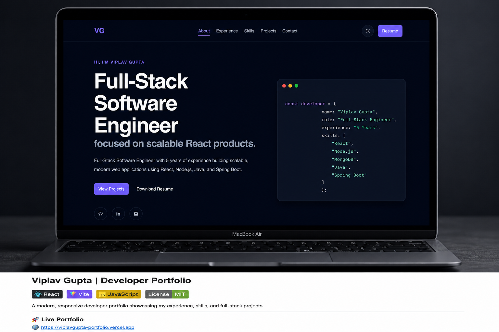

# Viplav Gupta | Developer Portfolio



A modern, responsive developer portfolio showcasing my professional experience, technical skills, and full-stack software projects built with React, Node.js, Java, and Spring Boot.

🌐 **Live Portfolio:** https://viplavgupta-portfolio.vercel.app/

---

## 🚀 Tech Stack

### Frontend
- React.js
- JavaScript (ES6+)
- Vite
- CSS3
- Framer Motion
- React Icons

### Backend
- Node.js
- Express.js
- Java
- Spring Boot
- Spring Security
- Spring Data JPA
- REST APIs

### Database
- MongoDB
- PostgreSQL

---

## ✨ Features

- Responsive design for desktop, tablet, and mobile
- Light & Dark theme support
- Smooth animations powered by Framer Motion
- Modular and reusable component architecture
- Professional experience timeline
- Featured project showcase
- Resume download
- SEO-friendly metadata
- Clean and scalable codebase

---

## 📂 Featured Projects

### 🎫 SupportDesk

A production-focused customer support platform that enables customers, agents, and administrators to efficiently manage support tickets through a secure role-based workflow.

**Highlights**
- JWT Authentication & Authorization
- Role-Based Access Control (Customer, Agent & Admin)
- Ticket lifecycle management
- Pagination, Sorting, Filtering & Search
- RESTful API architecture
- MongoDB integration
- React Query for efficient data fetching
- Scalable and maintainable architecture

> 🚧 **Currently under active development.** New features and live demo will be available soon.

---

### 🔄 Shift Swap Management System

A workflow-driven application that enables employees to request shift swaps while managers review, approve, or reject requests through a secure approval workflow.

**Highlights**
- JWT Authentication
- Role-Based Authorization
- Shift Swap Approval Workflow
- RESTful APIs
- MongoDB Integration
- Audit-friendly workflow design

> **Live Demo Notice:** The backend is deployed on Render's free tier. The initial request after inactivity may take up to 30–60 seconds while the service starts. Subsequent requests respond normally.

---

## 🛠️ Getting Started

### Clone the repository

```bash
git clone https://github.com/viplavg/VG-Portfolio.git
```

### Navigate to the project

```bash
cd VG-Portfolio
```

### Install dependencies

```bash
npm install
```

### Start the development server

```bash
npm run dev
```

### Build for production

```bash
npm run build
```

---

## 📫 Connect With Me

**Portfolio**
- https://viplavgupta-portfolio.vercel.app/

**LinkedIn**
- https://linkedin.com/in/viplavg

**GitHub**
- https://github.com/viplavg

**Email**
- viplavg1999@gmail.com

---

## 📄 License

This project is licensed under the MIT License.

---

⭐ If you like this project, feel free to fork it or leave a star on GitHub.